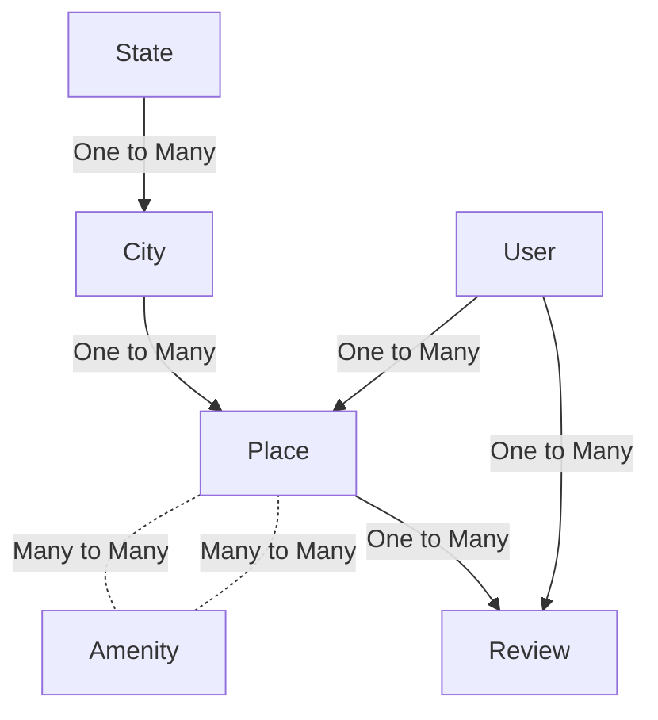

```mermaid
graph TD;
    State -- "One to Many" --> City;
    City -- "One to Many" --> Place;
    Place -. "Many to Many" .- Amenity;
    Place -- "One to Many" --> Review;
    Amenity -. "Many to Many" .- Place;
    User -- "One to Many" --> Place;
    User -- "One to Many" --> Review;
```
