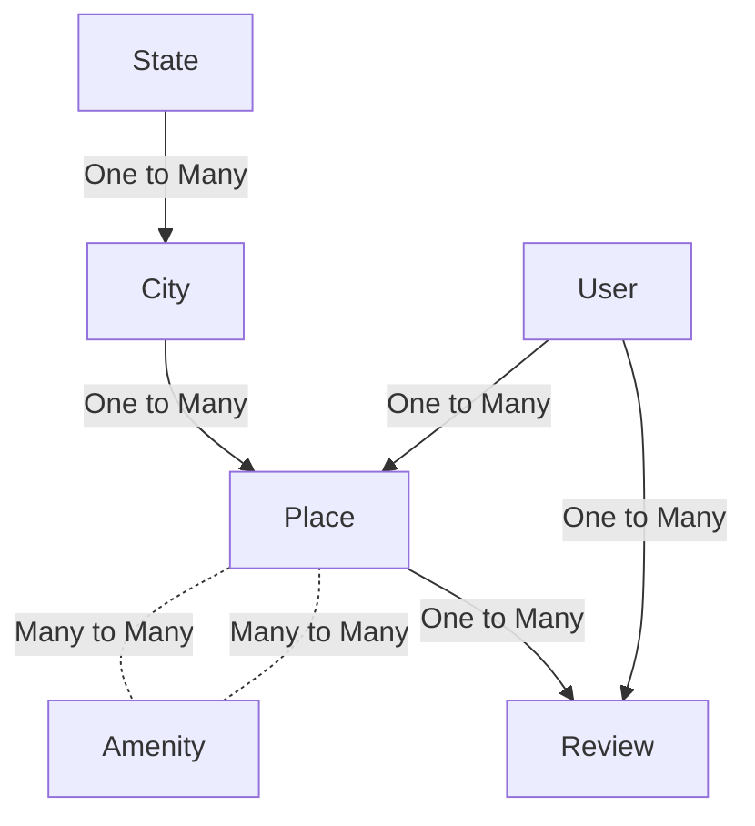

# HBNB - Airbnb Clone

Welcome to HBNB, an Airbnb clone project!

## Project Overview

HBNB is an Airbnb clone developed in Python. The project is currently in its third version (v3). Here's an overview of the project's evolution:

### Version 1 (v1)

In the first version, we developed a console application to control creating instances and manipulate these instances. Key features of the console include:

- Creating, updating, and deleting instances of various classes/models.
- Handling operations such as `count`, `all`, `create`, `show`, `destroy`, and `update`.
- Implemented classes/models including `State`, `City`, `Place`, `Amenity`, `User`, `Review`, and `place_amenity`.
- Utilized `file_storage.py` to save instances to a JSON file.

### Version 2 (v2)

The second version introduced a simple static single-page HTML and CSS interface. This version focused on the presentation layer and provided a basic user interface for the application.

### Version 3 (v3)

In the latest version, we expanded the project to include database storage using SQLAlchemy and MySQL. Key features of version 3 include:

- Implemented database models for the classes introduced in v1.
- Created `db_storage.py` to control data storage and retrieval using a relational database.
- Allowed users to choose between file-based storage and database storage using the `HBNB_TYPE_STORAGE` environment variable.

## Entity Relationship Diagram (ERD)

The following diagram illustrates the relationships between different entities in the HBNB project:

## Environment Setup

Choose the storage type by setting the `HBNB_TYPE_STORAGE` environment variable to either `db` for database storage or `file` for file-based storage.

## Usage

### Console Commands

The following console commands are available for interaction:

- `create <class_name> <param1> <param2> <param3> ...`: Create a new object of the specified class and initialize it with the provided parameters.
- `show <class_name> <id>`: Display details of the object with the specified ID.
- `destroy <class_name> <id>`: Delete the object with the specified ID.
- `all <class_name>`: List all objects of the specified class.
- `update <class_name> <id> <attribute_name> "<attribute_value>"`: Modify the specified attribute of the object with the given ID.
- `count <class_name>`: Calculate the number of objects of the specified class.

Additionally, you can use dots (.) and pass parameters in the following format:

- `<class_name>.show(<id>)`: Display details of the object with the specified ID.
- `<class_name>.destroy(<id>)`: Delete the object with the specified ID.
- `<class_name>.update(<id>, <dictionary_representation>)`: Modify the object attributes using a dictionary representation.
- `<class_name>.update(<id>, <attribute_name>, <attribute_value>)`: Modify the specified attribute of the object with the given ID.

You can use these commands in the project's console interface to interact with the application and perform various operations on objects.
